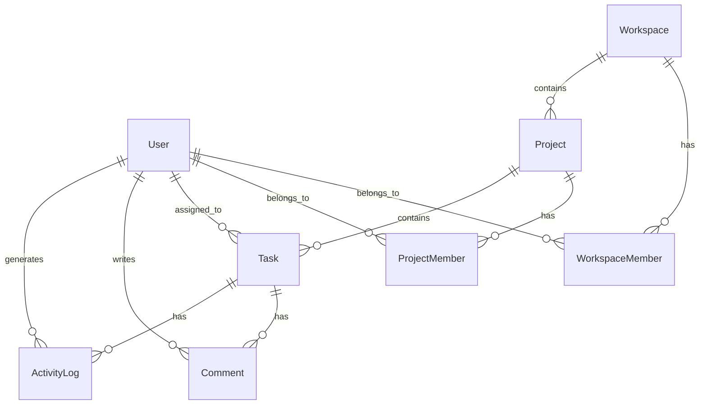

# Detask - Collaborative Task Management

A production-grade collaborative task management application built for the hackathon.

## Tech Stack
- **Frontend**: Next.js 14 (App Router) + TypeScript + Tailwind CSS + shadcn/ui
- **Database**: SQLite for local development via Prisma (schema designed to be swapped to PostgreSQL for production with a single provider change)
- **Auth**: NextAuth.js (JWT sessions, bcrypt)
- **Real-time**: Pusher
- **State/Data**: Server Actions + React State

## Setup Instructions

1. **Install dependencies**
   ```bash
   npm install
   ```

2. **Setup environment variables**
   A `.env` file has been provided in this repository for local testing with dummy Pusher credentials.

3. **Initialize Database**
   ```bash
   npx prisma db push
   npx prisma generate
   ```

4. **Seed Database (Important!)**
   ```bash
   npm run prisma:seed # (or npx tsx prisma/seed.ts)
   ```

5. **Run Development Server**
   ```bash
   npm run dev
   ```

## Demo Credentials

The database seed script creates three users with different roles for testing:

- **Admin**: `admin@detask.com` / `password123`
- **Manager**: `manager@detask.com` / `password123`
- **Member**: `member1@detask.com` / `password123`

## ER Diagram



Please see `ARCHITECTURE.md` for details on RBAC and Real-time integration.
