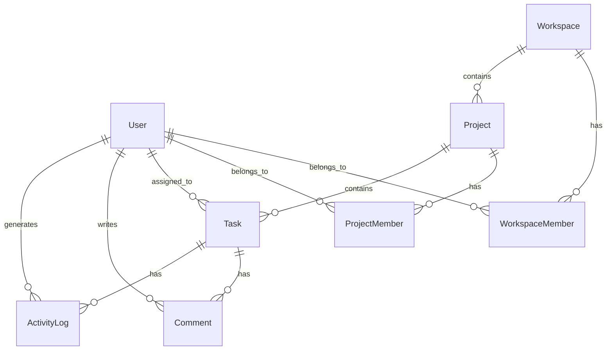

# ⚡ Detask — Modern Collaborative Task Management

<div align="center">


**A high-performance, production-grade collaborative Kanban & project management application.** Built with role-based access control, server actions, real-time activity auditing, and a sleek dark aesthetic.

[Key Features](#-key-features) • [Tech Stack](#-tech-stack) • [Quick Start](#-quick-start) • [Demo Accounts](#-demo-accounts) • [Architecture](#-architecture)

---

</div>

## ✨ Key Features

- 📋 **Fluid Kanban Board**: Move tasks across **To Do**, **In Progress**, and **Done** with priority badges (`HIGH`, `MEDIUM`, `LOW`), assignee avatars, and comment badges.
- 📁 **Project Management**: Create, switch, mark completed, or delete projects seamlessly.
- 🛡️ **Role-Based Access Control (RBAC)**: Fine-grained permissions enforced across Admin, Manager, and Member roles both on the UI and Server Actions level.
- 💬 **Task Detail & Comments**: Rich task dialogs with assignee selection, priority updates, and team comments.
- 📜 **Activity Audit Trail**: Automatic logging for task creation, status transitions, and project modifications.
- 👥 **Team Management**: Workspace member roster with role controls and status indicators.
- 🎨 **Modern Dark Aesthetic**: Custom glassmorphic interfaces, tailored purple/indigo gradients, and micro-animations.

---

## 🛠️ Tech Stack

- **Framework**: Next.js 14 (App Router, Server Components & Server Actions)
- **Language**: TypeScript
- **Styling**: Tailwind CSS, Vanilla CSS Glassmorphism, Lucide Icons
- **Database**: SQLite (via Prisma ORM, seamlessly scalable to PostgreSQL/MySQL)
- **Authentication**: NextAuth.js (JWT Sessions, bcrypt password hashing)
- **State Management**: Zustand & React Client Components

---

## 🚀 Quick Start

### 1. Clone & Install Dependencies
```bash
git clone https://github.com/Ansika-Singh/Detask.git
cd Detask
npm install
```

### 2. Configure Environment Variables
Copy `.env.example` to `.env`:
```bash
DATABASE_URL="file:./dev.db"
NEXTAUTH_SECRET="detask-super-secret-key-change-in-production"
NEXTAUTH_URL="http://localhost:3000"
```

### 3. Initialize & Seed Database
```bash
# Push schema to SQLite database
npx prisma db push

# Generate Prisma Client
npx prisma generate

# Populate database with sample projects, tasks, and users
npx tsx prisma/seed.ts
```

### 4. Run Development Server
```bash
npm run dev
```
Open [http://localhost:3000](http://localhost:3000) in your browser.

---

## 🔑 Demo Accounts

Use any of the seeded demo accounts to test different role permissions:

| Role | Email | Password | Permissions |
| :--- | :--- | :--- | :--- |
| **Admin** | `admin@detask.com` | `password123` | Full access: Create/Delete Projects, Manage Team, Tasks |
| **Manager** | `manager@detask.com` | `password123` | Create Tasks, Move Tasks, View Team Roster |
| **Member** | `member1@detask.com` | `password123` | View Projects, Move Assigned Tasks, Add Comments |

---

## 📐 Architecture & Entity Model



---

## 📂 Project Structure

```text
Detask/
├── prisma/
│   ├── schema.prisma        # Prisma data models & constraints
│   └── seed.ts              # Comprehensive database seeding script
├── src/
│   ├── app/
│   │   ├── actions/         # Next.js Server Actions (Project, Task, Team)
│   │   ├── api/             # NextAuth authentication API routes
│   │   ├── dashboard/       # Dashboard workspace page
│   │   ├── login/           # Custom login page
│   │   ├── register/        # Account registration page
│   │   ├── team/            # Team roster & permissions page
│   │   └── page.tsx         # Modern landing page & product preview
│   ├── components/          # Reusable UI components & Kanban Board
│   └── lib/                 # Auth options, RBAC permissions, Prisma client
└── ARCHITECTURE.md          # In-depth architectural design manifesto
```

---

<div align="center">

Built with ❤️ for the Hackathon.

</div>

